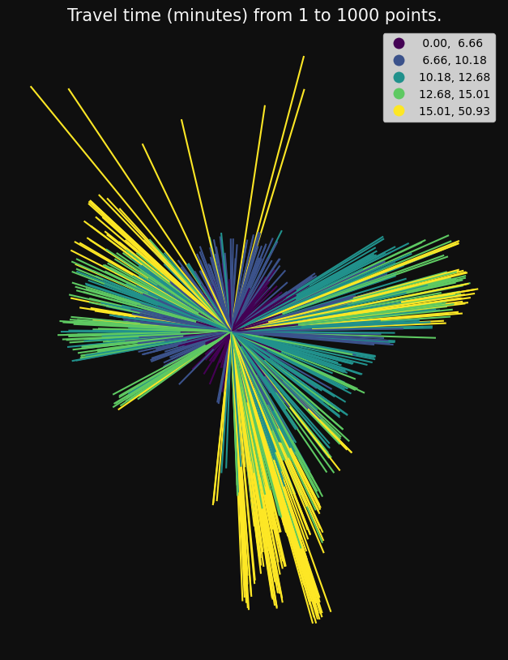

## Network analysis

The package supports three types of network analysis, and methods for customising and optimising your road data.

Analysis can start by initialising a NetworkAnalysis instance:

```python
from gis_utils import DirectedNetwork, NetworkAnalysis, NetworkAnalysisRules


roads = gpd.read_parquet("tests/testdata/roads_oslo_2022.parquet")

nw = (
    DirectedNetwork(roads)
    .remove_isolated()
    .make_directed_network(
        direction_col="oneway",
        direction_vals_bft=("B", "FT", "TF"),
        minute_cols=("drivetime_fw", "drivetime_bw"),
    )
)

rules = NetworkAnalysisRules(weight="minutes")

nwa = NetworkAnalysis(network=nw, rules=rules)

nwa
```

    NetworkAnalysis(network=DirectedNetwork(6364 km, directed=True), rules=NetworkAnalysisRules(weight='minutes', search_tolerance=250, search_factor=10, split_lines, ...))

```python
points = gpd.read_parquet("tests/testdata/random_points.parquet")
```

### od_cost_matrix

Fast many-to-many travel times/distances

```python
od = nwa.od_cost_matrix(points.iloc[[0]], points, lines=True)

print(od.head(3))

gs.qtm(
    od,
    "minutes",
    title="Travel time (minutes) from 1 to 1000 points.",
    **plot_kwargs,
)
```

      origin destination    minutes  \
    0  79166       79167   0.000000
    1  79166       79168  12.930588
    2  79166       79169  10.867076

                                                geometry
    0  LINESTRING (263122.700 6651184.900, 263122.700...
    1  LINESTRING (263122.700 6651184.900, 272456.100...
    2  LINESTRING (263122.700 6651184.900, 270082.300...



### get_route

Get the actual paths:

```python
routes = nwa.get_route(points.iloc[[0]], points.sample(100), id_col="idx")

gs.qtm(
    gs.buff(routes, 12),
    "minutes",
    cmap="plasma",
    title="Travel times (minutes)",
    **plot_kwargs,
)

routes
```

<div>
<style scoped>
    .dataframe tbody tr th:only-of-type {
        vertical-align: middle;
    }

    .dataframe tbody tr th {
        vertical-align: top;
    }

    .dataframe thead th {
        text-align: right;
    }

</style>
<table border="1" class="dataframe">
  <thead>
    <tr style="text-align: right;">
      <th></th>
      <th>origin</th>
      <th>destination</th>
      <th>minutes</th>
      <th>geometry</th>
    </tr>
  </thead>
  <tbody>
    <tr>
      <th>0</th>
      <td>1</td>
      <td>253</td>
      <td>8.997494</td>
      <td>MULTILINESTRING Z ((263328.100 6648382.100 13....</td>
    </tr>
    <tr>
      <th>1</th>
      <td>1</td>
      <td>140</td>
      <td>8.467940</td>
      <td>MULTILINESTRING Z ((266440.152 6649542.543 105...</td>
    </tr>
    <tr>
      <th>2</th>
      <td>1</td>
      <td>731</td>
      <td>11.256682</td>
      <td>MULTILINESTRING Z ((261276.828 6654115.849 146...</td>
    </tr>
    <tr>
      <th>3</th>
      <td>1</td>
      <td>880</td>
      <td>2.800987</td>
      <td>MULTILINESTRING Z ((263171.800 6651250.200 46....</td>
    </tr>
    <tr>
      <th>4</th>
      <td>1</td>
      <td>115</td>
      <td>21.531177</td>
      <td>MULTILINESTRING Z ((266999.100 6640759.200 133...</td>
    </tr>
    <tr>
      <th>...</th>
      <td>...</td>
      <td>...</td>
      <td>...</td>
      <td>...</td>
    </tr>
    <tr>
      <th>94</th>
      <td>1</td>
      <td>587</td>
      <td>19.764130</td>
      <td>MULTILINESTRING Z ((265170.780 6640873.429 111...</td>
    </tr>
    <tr>
      <th>95</th>
      <td>1</td>
      <td>861</td>
      <td>8.411844</td>
      <td>MULTILINESTRING Z ((262623.190 6652506.640 79....</td>
    </tr>
    <tr>
      <th>96</th>
      <td>1</td>
      <td>460</td>
      <td>2.745346</td>
      <td>MULTILINESTRING Z ((262841.200 6651029.403 30....</td>
    </tr>
    <tr>
      <th>97</th>
      <td>1</td>
      <td>487</td>
      <td>10.561253</td>
      <td>MULTILINESTRING Z ((262623.190 6652506.640 79....</td>
    </tr>
    <tr>
      <th>98</th>
      <td>1</td>
      <td>964</td>
      <td>8.840229</td>
      <td>MULTILINESTRING Z ((263171.800 6651250.200 46....</td>
    </tr>
  </tbody>
</table>
<p>99 rows × 4 columns</p>
</div>


### get_route_frequencies

Get the number of times each line segment was used:

```python
freq = nwa.get_route_frequencies(points.sample(100), points.sample(100))

gs.qtm(
    gs.buff(freq, 15),
    "n",
    scheme="naturalbreaks",
    cmap="plasma",
    title="Number of times each road was used.",
    **plot_kwargs,
)
```


### Service area

Get the area that can be reached within one or more breaks

```python
sa = nwa.service_area(points.iloc[[0]], breaks=np.arange(1, 11), dissolve=False)

sa = sa.drop_duplicates(["source", "target"])

gs.qtm(
    sa,
    "minutes",
    k=10,
    title="Roads that can be reached within 1 to 10 minutes",
    legend=False,
    **plot_kwargs,
)
```


Check the log:

```python
nwa.log
```

<div>
<style scoped>
    .dataframe tbody tr th:only-of-type {
        vertical-align: middle;
    }

    .dataframe tbody tr th {
        vertical-align: top;
    }

    .dataframe thead th {
        text-align: right;
    }

</style>
<table border="1" class="dataframe">
  <thead>
    <tr style="text-align: right;">
      <th></th>
      <th>endtime</th>
      <th>minutes_elapsed</th>
      <th>function</th>
      <th>origins_count</th>
      <th>destinations_count</th>
      <th>percent_missing</th>
      <th>cost_mean</th>
      <th>isolated_removed</th>
      <th>percent_directional</th>
      <th>weight</th>
      <th>...</th>
      <th>cost_p25</th>
      <th>cost_median</th>
      <th>cost_p75</th>
      <th>cost_std</th>
      <th>lines</th>
      <th>cutoff</th>
      <th>destination_count</th>
      <th>rowwise</th>
      <th>breaks</th>
      <th>dissolve</th>
    </tr>
  </thead>
  <tbody>
    <tr>
      <th>0</th>
      <td>2023-02-27 09:26:20</td>
      <td>0.1</td>
      <td>od_cost_matrix</td>
      <td>1</td>
      <td>1000.0</td>
      <td>0.2</td>
      <td>11.286299</td>
      <td>True</td>
      <td>46</td>
      <td>minutes</td>
      <td>...</td>
      <td>7.660459</td>
      <td>11.573666</td>
      <td>14.151198</td>
      <td>5.091459</td>
      <td>True</td>
      <td>None</td>
      <td>None</td>
      <td>False</td>
      <td>NaN</td>
      <td>NaN</td>
    </tr>
    <tr>
      <th>1</th>
      <td>2023-02-27 09:26:43</td>
      <td>0.4</td>
      <td>get_route</td>
      <td>1</td>
      <td>100.0</td>
      <td>0.0</td>
      <td>11.562200</td>
      <td>True</td>
      <td>46</td>
      <td>minutes</td>
      <td>...</td>
      <td>8.645376</td>
      <td>11.979878</td>
      <td>14.941869</td>
      <td>5.239173</td>
      <td>NaN</td>
      <td>None</td>
      <td>None</td>
      <td>False</td>
      <td>NaN</td>
      <td>NaN</td>
    </tr>
    <tr>
      <th>2</th>
      <td>2023-02-27 09:30:30</td>
      <td>3.7</td>
      <td>get_route_frequencies</td>
      <td>100</td>
      <td>100.0</td>
      <td>NaN</td>
      <td>NaN</td>
      <td>True</td>
      <td>46</td>
      <td>minutes</td>
      <td>...</td>
      <td>NaN</td>
      <td>NaN</td>
      <td>NaN</td>
      <td>NaN</td>
      <td>NaN</td>
      <td>None</td>
      <td>None</td>
      <td>NaN</td>
      <td>NaN</td>
      <td>NaN</td>
    </tr>
    <tr>
      <th>3</th>
      <td>2023-02-27 09:31:04</td>
      <td>0.1</td>
      <td>service_area</td>
      <td>1</td>
      <td>NaN</td>
      <td>0.0</td>
      <td>7.909540</td>
      <td>True</td>
      <td>46</td>
      <td>minutes</td>
      <td>...</td>
      <td>7.000000</td>
      <td>8.000000</td>
      <td>10.000000</td>
      <td>1.907413</td>
      <td>NaN</td>
      <td>NaN</td>
      <td>NaN</td>
      <td>NaN</td>
      <td>1, 2, 3, 4, 5, 6, 7, 8, 9, 10</td>
      <td>False</td>
    </tr>
  </tbody>
</table>
<p>4 rows × 26 columns</p>
</div>

## Developer information

### Git LFS

The data in the testdata directory is stored with [Git LFS](https://git-lfs.com/).
Make sure `git-lfs` is installed and that you have run the command `git lfs install`
at least once. You only need to run this once per user account.

### Dependencies

[Poetry](https://python-poetry.org/) is used for dependency management. Install
poetry and run the command below from the root directory to install the dependencies.

```shell
poetry install --no-root
```

### Tests

Use the following command from the root directory to run the tests:

```shell
poetry run pytest  # from root directory
```

#### Jupyter Notebooks

The files ending with `_ipynb.py` in the tests directory are jupyter notebooks
stored as plain python files, using `jupytext`. To open them as Jupyter notebooks,
right-click on them in JupyterLab and select Open With &rarr; Notebook.

When testing locally, start JupyterLab with this command:

```shell
poetry run jupter lab
```

For VS Code there are extensions for opening a python script as Jupyter Notebook,
for example:
[Jupytext for Notebooks](https://marketplace.visualstudio.com/items?itemName=donjayamanne.vscode-jupytext).

### Formatting

Format the code with `black` and `isort` by running the following command from the
root directory:

```shell
poetry run black .
poetry run isort .
```

### Pre-commit hooks

We are using [pre-commit hooks](https://pre-commit.com/) to make sure the code is
correctly formatted and consistent before committing. Use the following command from
the root directory in the repo to install the pre-commit hooks:

```shell
poetry run pre-commit install
```

It then checks the changed files before committing. You can run the pre-commit checks
on all files by using this command:

```shell
poetry run pre-commit run --all-files
```
