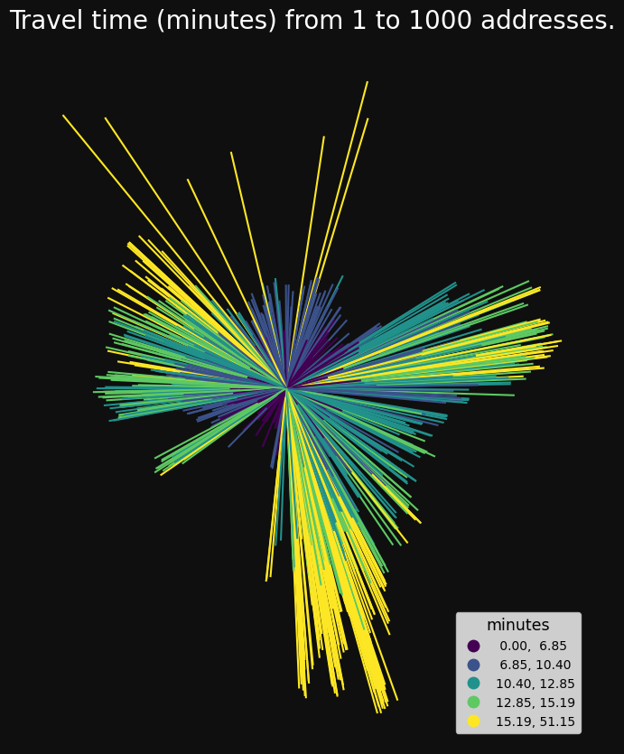
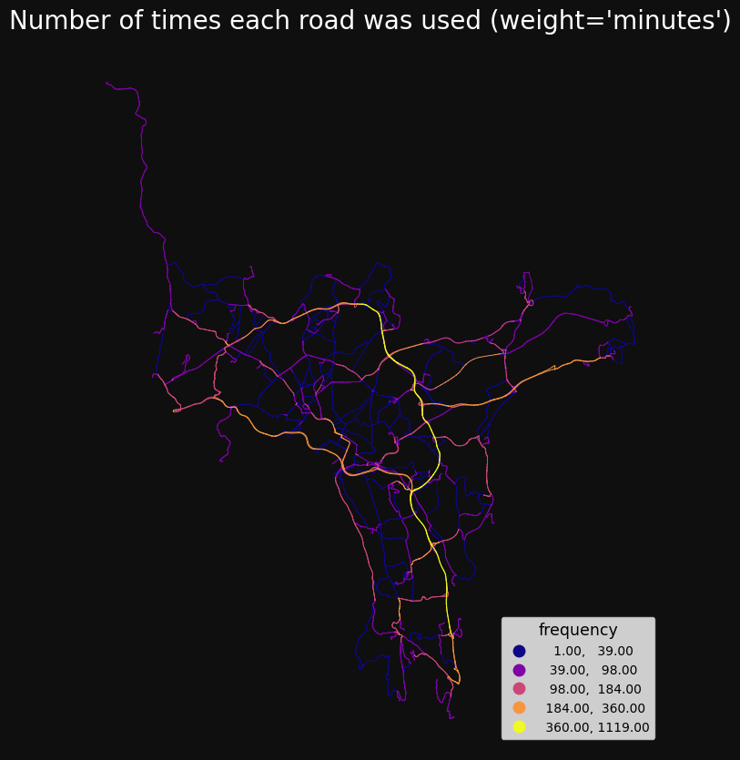
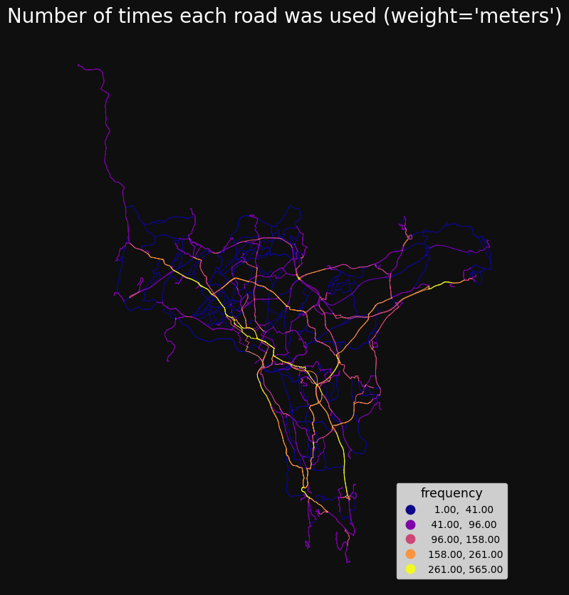
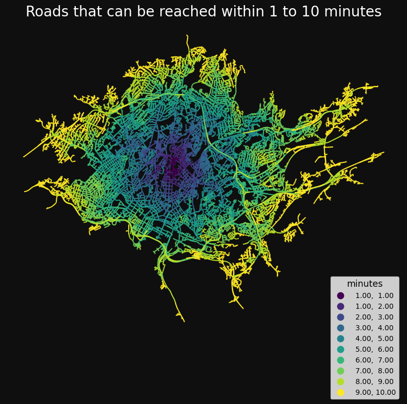
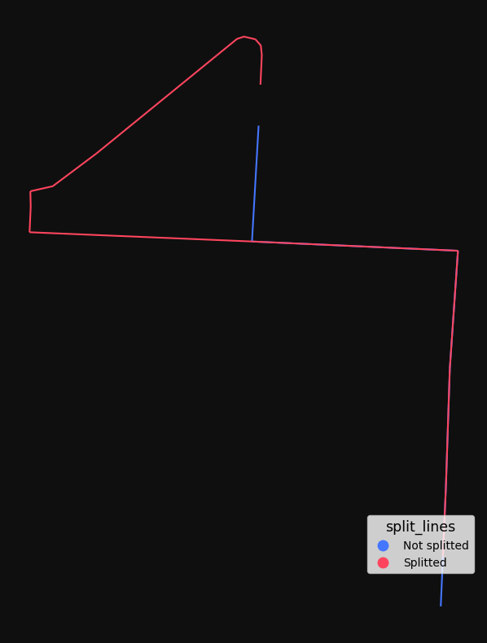

# Network analysis demo

```python
import os
import warnings

import numpy as np
import pandas as pd


os.chdir("../../src")

import sgis as sg


# ignore some warnings
pd.options.mode.chained_assignment = None
warnings.filterwarnings(action="ignore", category=FutureWarning)
```

The network analysis happens in the NetworkAnalysis class.
It takes a network and a set of rules for the analysis:

The rules can be instantiated like this:

```python
rules = sg.NetworkAnalysisRules(weight="minutes")
rules
```

    NetworkAnalysisRules(weight='minutes', search_tolerance=250, search_factor=0, split_lines=False, nodedist_multiplier=None, nodedist_kmh=None)

To create the network, we need some road data:

```python
roads = sg.read_parquet_url(
    "https://media.githubusercontent.com/media/statisticsnorway/ssb-sgis/main/tests/testdata/roads_oslo_2022.parquet"
)
roads = roads[["oneway", "drivetime_fw", "drivetime_bw", "geometry"]]
roads.head(3)
```

<div>
<style scoped>
    .dataframe tbody tr th:only-of-type {
        vertical-align: middle;
    }

    .dataframe tbody tr th {
        vertical-align: top;
    }

    .dataframe thead th {
        text-align: right;
    }

</style>
<table border="1" class="dataframe">
  <thead>
    <tr style="text-align: right;">
      <th></th>
      <th>oneway</th>
      <th>drivetime_fw</th>
      <th>drivetime_bw</th>
      <th>geometry</th>
    </tr>
  </thead>
  <tbody>
    <tr>
      <th>119702</th>
      <td>B</td>
      <td>0.216611</td>
      <td>0.216611</td>
      <td>MULTILINESTRING Z ((258028.440 6674249.890 413...</td>
    </tr>
    <tr>
      <th>199710</th>
      <td>FT</td>
      <td>0.099323</td>
      <td>-1.000000</td>
      <td>MULTILINESTRING Z ((271778.700 6653238.900 138...</td>
    </tr>
    <tr>
      <th>199725</th>
      <td>FT</td>
      <td>0.173963</td>
      <td>-1.000000</td>
      <td>MULTILINESTRING Z ((271884.510 6653207.540 142...</td>
    </tr>
  </tbody>
</table>
</div>

The road data can be made into a Network instance like this:

```python
nw = sg.Network(roads)
nw
```

    Network(3851 km, undirected)

The Network is now ready for undirected network analysis. The network can also be optimises with methods stored in the Network class. More about this further down in this notebook.

```python
nw = (
    nw.close_network_holes(1.5, max_angle=90, fillna=0).remove_isolated().cut_lines(250)
)
nw
```

    Network(3832 km, undirected)

For directed network analysis, the DirectedNetwork class can be used. This inherits all methods from the Network class, and also includes methods for making a directed network.

```python
nw = sg.DirectedNetwork(roads).remove_isolated()
nw
```

    DirectedNetwork(3407 km, percent_bidirectional=0)

We now have a DirectedNetwork instance. However, the network isn't actually directed yet, as indicated by the percent_bidirectional attribute above.

The roads going both ways have to be duplicated and the geometry of the new lines have to be flipped. The roads going backwards also have to be flipped.

This can be done with the make_directed_network method:

```python
nw = nw.make_directed_network(
    direction_col="oneway",
    direction_vals_bft=("B", "FT", "TF"),
    speed_col=None,
    minute_cols=("drivetime_fw", "drivetime_bw"),
    flat_speed=None,
)
nw
```

    DirectedNetwork(6364 km, percent_bidirectional=87)

The network has now almost doubled in length, since most roads are bidirectional in this network.

Norwegian road data can be made directional with a custom method:

```python
nw = sg.DirectedNetwork(roads).remove_isolated().make_directed_network_norway()
nw
```

    DirectedNetwork(6364 km, percent_bidirectional=87)

## NetworkAnalysis

To start the network analysis, we put our network and our rules into the NetworkAnalysis class:

```python
nwa = sg.NetworkAnalysis(network=nw, rules=rules, detailed_log=False)
nwa
```

    NetworkAnalysis(
        network=DirectedNetwork(6364 km, percent_bidirectional=87),
        rules=NetworkAnalysisRules(weight=minutes, search_tolerance=250, search_factor=0, split_lines=False, ...),
        log=True, detailed_log=False,
    )

We also need some points that will be our origins and destinations:

```python
points = sg.read_parquet_url(
    "https://media.githubusercontent.com/media/statisticsnorway/ssb-sgis/main/tests/testdata/points_oslo.parquet"
)
points
```

<div>
<style scoped>
    .dataframe tbody tr th:only-of-type {
        vertical-align: middle;
    }

    .dataframe tbody tr th {
        vertical-align: top;
    }

    .dataframe thead th {
        text-align: right;
    }

</style>
<table border="1" class="dataframe">
  <thead>
    <tr style="text-align: right;">
      <th></th>
      <th>idx</th>
      <th>geometry</th>
    </tr>
  </thead>
  <tbody>
    <tr>
      <th>0</th>
      <td>1</td>
      <td>POINT (263122.700 6651184.900)</td>
    </tr>
    <tr>
      <th>1</th>
      <td>2</td>
      <td>POINT (272456.100 6653369.500)</td>
    </tr>
    <tr>
      <th>2</th>
      <td>3</td>
      <td>POINT (270082.300 6653032.700)</td>
    </tr>
    <tr>
      <th>3</th>
      <td>4</td>
      <td>POINT (259804.800 6650339.700)</td>
    </tr>
    <tr>
      <th>4</th>
      <td>5</td>
      <td>POINT (272876.200 6652889.100)</td>
    </tr>
    <tr>
      <th>...</th>
      <td>...</td>
      <td>...</td>
    </tr>
    <tr>
      <th>995</th>
      <td>996</td>
      <td>POINT (266801.700 6647844.500)</td>
    </tr>
    <tr>
      <th>996</th>
      <td>997</td>
      <td>POINT (261274.000 6653593.400)</td>
    </tr>
    <tr>
      <th>997</th>
      <td>998</td>
      <td>POINT (263542.900 6645427.000)</td>
    </tr>
    <tr>
      <th>998</th>
      <td>999</td>
      <td>POINT (269226.700 6650628.000)</td>
    </tr>
    <tr>
      <th>999</th>
      <td>1000</td>
      <td>POINT (264570.300 6644239.500)</td>
    </tr>
  </tbody>
</table>
<p>1000 rows × 2 columns</p>
</div>

### OD cost matrix

od_cost_matrix calculates the traveltime from a set of origins to a set of destinations:

```python
od = nwa.od_cost_matrix(origins=points, destinations=points)
od
```

<div>
<style scoped>
    .dataframe tbody tr th:only-of-type {
        vertical-align: middle;
    }

    .dataframe tbody tr th {
        vertical-align: top;
    }

    .dataframe thead th {
        text-align: right;
    }

</style>
<table border="1" class="dataframe">
  <thead>
    <tr style="text-align: right;">
      <th></th>
      <th>origin</th>
      <th>destination</th>
      <th>minutes</th>
    </tr>
  </thead>
  <tbody>
    <tr>
      <th>0</th>
      <td>0</td>
      <td>0</td>
      <td>0.000000</td>
    </tr>
    <tr>
      <th>1</th>
      <td>0</td>
      <td>1</td>
      <td>2</td>
      <td>13.039830</td>
    </tr>
    <tr>
      <th>2</th>
      <td>0</td>
      <td>2</td>
      <td>10.902453</td>
    </tr>
    <tr>
      <th>3</th>
      <td>0</td>
      <td>3</td>
      <td>8.297021</td>
    </tr>
    <tr>
      <th>4</th>
      <td>0</td>
      <td>4</td>
      <td>14.742294</td>
    </tr>
    <tr>
      <th>...</th>
      <td>...</td>
      <td>...</td>
      <td>...</td>
    </tr>
    <tr>
      <th>999995</th>
      <td>999</td>
      <td>995</td>
      <td>11.038673</td>
    </tr>
    <tr>
      <th>999996</th>
      <td>999</td>
      <td>996</td>
      <td>17.820664</td>
    </tr>
    <tr>
      <th>999997</th>
      <td>999</td>
      <td>997</td>
      <td>10.288465</td>
    </tr>
    <tr>
      <th>999998</th>
      <td>1000</td>
      <td>999</td>
      <td>998</td>
      <td>14.798257</td>
    </tr>
    <tr>
      <th>999999</th>
      <td>999</td>
      <td>999</td>
      <td>0.000000</td>
    </tr>
  </tbody>
</table>
<p>1000000 rows × 3 columns</p>
</div>

Set 'lines' to True to get a geometry column with straight lines between origin and
destination:

```python
od = nwa.od_cost_matrix(points.iloc[[0]], points, lines=True)

sg.qtm(
    od,
    "minutes",
    title="Travel time (minutes) from 1 to 1000 addresses.",
    scheme="quantiles",
)
```



Information about the analyses are stored in a DataFrame in the 'log' attribute.

```python
print(nwa.log)
```

                  endtime  minutes_elapsed          method  origins_count  \
    0 2023-03-29 09:34:49              0.5  od_cost_matrix           1000
    1 2023-03-29 09:34:56              0.1  od_cost_matrix              1

       destinations_count  percent_missing  cost_mean
    0                1000           0.9966  15.270462
    1                1000           0.4000  11.476453

### Get route

The get_route method can be used to get the actual lowest cost path:

```python
routes = nwa.get_route(points.iloc[[0]], points.sample(100))

sg.qtm(
    sg.buff(routes, 12),
    "minutes",
    cmap="plasma",
    title="Travel times (minutes)",
)

routes
```


<div>
<style scoped>
    .dataframe tbody tr th:only-of-type {
        vertical-align: middle;
    }

    .dataframe tbody tr th {
        vertical-align: top;
    }

    .dataframe thead th {
        text-align: right;
    }

</style>
<table border="1" class="dataframe">
  <thead>
    <tr style="text-align: right;">
      <th></th>
      <th>origin</th>
      <th>destination</th>
      <th>minutes</th>
      <th>geometry</th>
    </tr>
  </thead>
  <tbody>
    <tr>
      <th>0</th>
      <td>0</td>
      <td>660</td>
      <td>10.819579</td>
      <td>MULTILINESTRING Z ((266612.400 6649059.000 87....</td>
    </tr>
    <tr>
      <th>1</th>
      <td>0</td>
      <td>426</td>
      <td>11.515883</td>
      <td>MULTILINESTRING Z ((267018.127 6648183.742 138...</td>
    </tr>
    <tr>
      <th>2</th>
      <td>0</td>
      <td>595</td>
      <td>5.641919</td>
      <td>MULTILINESTRING Z ((262841.200 6651029.403 30....</td>
    </tr>
    <tr>
      <th>3</th>
      <td>0</td>
      <td>721</td>
      <td>14.233810</td>
      <td>MULTILINESTRING Z ((263171.800 6651250.200 46....</td>
    </tr>
    <tr>
      <th>4</th>
      <td>0</td>
      <td>109</td>
      <td>10.096080</td>
      <td>MULTILINESTRING Z ((264626.356 6652897.926 130...</td>
    </tr>
    <tr>
      <th>...</th>
      <td>...</td>
      <td>...</td>
      <td>...</td>
      <td>...</td>
    </tr>
    <tr>
      <th>93</th>
      <td>0</td>
      <td>354</td>
      <td>15.080127</td>
      <td>MULTILINESTRING Z ((272281.367 6653079.745 160...</td>
    </tr>
    <tr>
      <th>94</th>
      <td>0</td>
      <td>227</td>
      <td>3.124035</td>
      <td>MULTILINESTRING Z ((262082.600 6651528.500 74....</td>
    </tr>
    <tr>
      <th>95</th>
      <td>0</td>
      <td>735</td>
      <td>11.954112</td>
      <td>MULTILINESTRING Z ((261352.158 6649521.080 6.6...</td>
    </tr>
    <tr>
      <th>96</th>
      <td>0</td>
      <td>719</td>
      <td>5.779328</td>
      <td>MULTILINESTRING Z ((262623.190 6652506.640 79....</td>
    </tr>
    <tr>
      <th>97</th>
      <td>0</td>
      <td>1</td>
      <td>13.039830</td>
      <td>MULTILINESTRING Z ((272281.367 6653079.745 160...</td>
    </tr>
  </tbody>
</table>
<p>98 rows × 4 columns</p>
</div>


### Get route frequencies

get_route_frequencies finds the number of times each road segment was used.

```python
pointsample = points.sample(75)
freq = nwa.get_route_frequencies(pointsample, pointsample)

sg.qtm(
    sg.buff(freq, 15),
    "frequency",
    scheme="naturalbreaks",
    cmap="plasma",
    title="Number of times each road was used (weight='minutes')",
)
```



The results will be quite different when it is the shortest, rather than the fastest, route that is used:

```python
nwa.rules.weight = "meters"

frequencies = nwa.get_route_frequencies(pointsample, pointsample)

sg.qtm(
    sg.buff(frequencies, 15),
    "frequency",
    scheme="naturalbreaks",
    cmap="plasma",
    title="Number of times each road was used (weight='meters')",
)
```



```python
nwa.rules.weight = "minutes"
```

### Service area

The service_area method finds the area that can be reached within one or more breaks.

Here, we find the areas that can be reached within 5, 10 and 15 minutes for five random points:

```python

service_areas = nwa.service_area(points.sample(5), breaks=(5, 10, 15))
service_areas
```

<div>
<style scoped>
    .dataframe tbody tr th:only-of-type {
        vertical-align: middle;
    }

    .dataframe tbody tr th {
        vertical-align: top;
    }

    .dataframe thead th {
        text-align: right;
    }

</style>
<table border="1" class="dataframe">
  <thead>
    <tr style="text-align: right;">
      <th></th>
      <th>minutes</th>
      <th>idx</th>
      <th>geometry</th>
    </tr>
  </thead>
  <tbody>
    <tr>
      <th>0</th>
      <td>5</td>
      <td>MULTILINESTRING Z ((262336.200 6644548.930 11....</td>
    </tr>
    <tr>
      <th>1</th>
      <td>10</td>
      <td>MULTILINESTRING Z ((263408.570 6645763.100 5.3...</td>
    </tr>
    <tr>
      <th>2</th>
      <td>15</td>
      <td>883</td>
      <td>MULTILINESTRING Z ((264348.673 6648271.134 17....</td>
    </tr>
    <tr>
      <th>3</th>
      <td>5</td>
      <td>289</td>
      <td>MULTILINESTRING Z ((260390.270 6651212.750 44....</td>
    </tr>
    <tr>
      <th>4</th>
      <td>10</td>
      <td>289</td>
      <td>MULTILINESTRING Z ((264348.673 6648271.134 17....</td>
    </tr>
    <tr>
      <th>5</th>
      <td>15</td>
      <td>289</td>
      <td>MULTILINESTRING Z ((266909.769 6651075.250 114...</td>
    </tr>
    <tr>
      <th>6</th>
      <td>5</td>
      <td>MULTILINESTRING Z ((257544.400 6657483.600 418...</td>
    </tr>
    <tr>
      <th>7</th>
      <td>10</td>
      <td>MULTILINESTRING Z ((257410.330 6656581.380 443...</td>
    </tr>
    <tr>
      <th>8</th>
      <td>15</td>
      <td>MULTILINESTRING Z ((258147.795 6657045.202 473...</td>
    </tr>
    <tr>
      <th>9</th>
      <td>5</td>
      <td>MULTILINESTRING Z ((256491.035 6652587.257 128...</td>
    </tr>
    <tr>
      <th>10</th>
      <td>10</td>
      <td>MULTILINESTRING Z ((256747.750 6655744.370 182...</td>
    </tr>
    <tr>
      <th>11</th>
      <td>15</td>
      <td>MULTILINESTRING Z ((256441.240 6660586.270 150...</td>
    </tr>
    <tr>
      <th>12</th>
      <td>5</td>
      <td>MULTILINESTRING Z ((265095.100 6643849.300 140...</td>
    </tr>
    <tr>
      <th>13</th>
      <td>10</td>
      <td>713</td>
      <td>MULTILINESTRING Z ((266909.769 6651075.250 114...</td>
    </tr>
    <tr>
      <th>14</th>
      <td>15</td>
      <td>713</td>
      <td>MULTILINESTRING Z ((264348.673 6648271.134 17....</td>
    </tr>
  </tbody>
</table>
</div>

```python
sa = nwa.service_area(points.iloc[[0]], breaks=np.arange(1, 11), id_col="idx")

sg.qtm(
    sa,
    "minutes",
    k=10,
    title="Roads that can be reached within 1 to 10 minutes",
)
sa
```

<div>
<style scoped>
    .dataframe tbody tr th:only-of-type {
        vertical-align: middle;
    }

    .dataframe tbody tr th {
        vertical-align: top;
    }

    .dataframe thead th {
        text-align: right;
    }

</style>
<table border="1" class="dataframe">
  <thead>
    <tr style="text-align: right;">
      <th></th>
      <th>minutes</th>
      <th>idx</th>
      <th>geometry</th>
      <th>label</th>
    </tr>
  </thead>
  <tbody>
    <tr>
      <th>0</th>
      <td>1</td>
      <td>1</td>
      <td>MULTILINESTRING Z ((263122.461 6651267.381 46....</td>
      <td>sa</td>
    </tr>
    <tr>
      <th>1</th>
      <td>2</td>
      <td>1</td>
      <td>MULTILINESTRING Z ((263889.223 6651115.545 63....</td>
      <td>sa</td>
    </tr>
    <tr>
      <th>2</th>
      <td>3</td>
      <td>1</td>
      <td>MULTILINESTRING Z ((262750.930 6651840.320 63....</td>
      <td>sa</td>
    </tr>
    <tr>
      <th>3</th>
      <td>4</td>
      <td>1</td>
      <td>MULTILINESTRING Z ((261870.921 6651358.348 77....</td>
      <td>sa</td>
    </tr>
    <tr>
      <th>4</th>
      <td>5</td>
      <td>1</td>
      <td>MULTILINESTRING Z ((265378.000 6650581.600 85....</td>
      <td>sa</td>
    </tr>
    <tr>
      <th>5</th>
      <td>6</td>
      <td>1</td>
      <td>MULTILINESTRING Z ((265262.829 6650519.242 78....</td>
      <td>sa</td>
    </tr>
    <tr>
      <th>6</th>
      <td>7</td>
      <td>1</td>
      <td>MULTILINESTRING Z ((264348.673 6648271.134 17....</td>
      <td>sa</td>
    </tr>
    <tr>
      <th>7</th>
      <td>8</td>
      <td>1</td>
      <td>MULTILINESTRING Z ((266903.800 6651086.560 114...</td>
      <td>sa</td>
    </tr>
    <tr>
      <th>8</th>
      <td>9</td>
      <td>1</td>
      <td>MULTILINESTRING Z ((263683.620 6648172.520 20....</td>
      <td>sa</td>
    </tr>
    <tr>
      <th>9</th>
      <td>10</td>
      <td>1</td>
      <td>MULTILINESTRING Z ((265657.500 6654844.860 296...</td>
      <td>sa</td>
    </tr>
  </tbody>
</table>
</div>



By default, only the lowest break is kept for overlapping areas from the same origin, meaning the area for minutes=10
covers not the entire area, only the outermost ring:

```python
sg.qtm(
    sa.query("minutes == 10"),
    color="yellow",
    title="Roads that can be reached within 10 minutes",
)
```

    c:\Users\ort\AppData\Local\Programs\Python\Python311\Lib\site-packages\geopandas\plotting.py:656: UserWarning: Only specify one of 'column' or 'color'. Using 'color'.
      warnings.warn(


This behaviour can be changed by setting drop_duplicates to False.

Duplicate lines from different origins will not be removed. To drop all duplicates, if many
origins in close proximity, set 'dissolve' to False to get each individual road or line returned,
and then drop rows afterwards:

```python
sa = nwa.service_area(points.sample(100), breaks=5, dissolve=False)
print("rows before drop_duplicates:", len(sa))
sa = sa.drop_duplicates(["source", "target"])
print("rows after drop_duplicates:", len(sa))
```

    rows before drop_duplicates: 632497
    rows after drop_duplicates: 143421

Let's check the log.

```python
print(nwa.log)
```

                  endtime  minutes_elapsed                 method  origins_count  \
    0 2023-03-16 09:10:16              0.4         od_cost_matrix           1000
    1 2023-03-16 09:10:22              0.1         od_cost_matrix              1
    2 2023-03-16 09:10:58              0.6              get_route              1
    3 2023-03-16 09:15:32              4.5  get_route_frequencies            100
    4 2023-03-16 09:21:34              5.9  get_route_frequencies            100
    5 2023-03-16 09:21:59              0.3           service_area              5
    6 2023-03-16 09:22:14              0.1           service_area              1
    7 2023-03-16 09:22:39              0.4           service_area            100

       destinations_count  percent_missing  cost_mean
    0              1000.0           0.9966  15.270462
    1              1000.0           0.4000  11.476453
    2               100.0           0.0000  11.714403
    3               100.0           0.0000   0.073649
    4               100.0           0.0000  39.437185
    5                 NaN           0.0000  10.000000
    6                 NaN           0.0000   5.500000
    7                 NaN           0.0000   5.000000

## Customising the network

```python
nw = sg.Network(roads)
nw
```

    Network(3851 km, undirected)

If you want to manipulate the roads after instantiating the Network, you can access the GeoDataFrame in the 'gdf' attribute:

```python
nw.gdf.head(3)
```

<div>
<style scoped>
    .dataframe tbody tr th:only-of-type {
        vertical-align: middle;
    }

    .dataframe tbody tr th {
        vertical-align: top;
    }

    .dataframe thead th {
        text-align: right;
    }

</style>
<table border="1" class="dataframe">
  <thead>
    <tr style="text-align: right;">
      <th></th>
      <th>oneway</th>
      <th>drivetime_fw</th>
      <th>drivetime_bw</th>
      <th>idx_orig</th>
      <th>meters</th>
      <th>source_wkt</th>
      <th>target_wkt</th>
      <th>source</th>
      <th>target</th>
      <th>n_source</th>
      <th>n_target</th>
      <th>geometry</th>
    </tr>
  </thead>
  <tbody>
    <tr>
      <th>0</th>
      <td>B</td>
      <td>0.216611</td>
      <td>0.216611</td>
      <td>119702</td>
      <td>36.838554</td>
      <td>POINT (258028.4400000004 6674249.890000001)</td>
      <td>POINT (258023.5 6674213.59)</td>
      <td>0</td>
      <td>49540</td>
      <td>1</td>
      <td>2</td>
      <td>LINESTRING Z (258028.440 6674249.890 413.751, ...</td>
    </tr>
    <tr>
      <th>1</th>
      <td>FT</td>
      <td>0.099323</td>
      <td>-1.000000</td>
      <td>199710</td>
      <td>110.359439</td>
      <td>POINT (271778.7000000002 6653238.9)</td>
      <td>POINT (271884.5099999998 6653207.539999999)</td>
      <td>1</td>
      <td>2</td>
      <td>2</td>
      <td>4</td>
      <td>LINESTRING Z (271778.700 6653238.900 138.671, ...</td>
    </tr>
    <tr>
      <th>2</th>
      <td>FT</td>
      <td>0.173963</td>
      <td>-1.000000</td>
      <td>199725</td>
      <td>193.291970</td>
      <td>POINT (271884.5099999998 6653207.539999999)</td>
      <td>POINT (272069.7999999998 6653152.5)</td>
      <td>2</td>
      <td>60241</td>
      <td>4</td>
      <td>2</td>
      <td>LINESTRING Z (271884.510 6653207.540 142.211, ...</td>
    </tr>
  </tbody>
</table>
</div>

### remove_isolated

The above log file has a column called 'isolated_removed'. This is set to True because the method 'remove_isolated' was used before the analyses.

Networks often consist of one large, connected network and many small, isolated "network islands".

origins and destinations located inside these isolated networks, will have a hard time finding their way out.

The large, connected network component can be found (not removed) with the method get_largest_component:

```python
nw = nw.get_largest_component()

# the GeoDataFrame of the network is stored in the gdf attribute:
nw.gdf["connected_str"] = np.where(nw.gdf.connected == 1, "connected", "isolated")

to_plot = nw.gdf.clip(points.iloc[[0]].buffer(1000))
sg.qtm(
    to_plot,
    column="connected_str",
    title="Connected and isolated networks",
    cmap="bwr",
)
```


Use the remove_isolated method to remove the unconnected roads:

```python

nwa = sg.NetworkAnalysis(network=nw, rules=sg.NetworkAnalysisRules(weight="meters"))
od = nwa.od_cost_matrix(points, points)
percent_missing = od[nwa.rules.weight].isna().mean() * 100
print(f"Before removing isolated: {percent_missing=:.2f}")
```

    Before removing isolated: percent_missing=23.25

```python
nwa.network = nwa.network.remove_isolated()

od = nwa.od_cost_matrix(points, points)
percent_missing = od[nwa.rules.weight].isna().mean() * 100
print(f"After removing isolated: {percent_missing=:.2f}")
```

    After removing isolated: percent_missing=0.40

If the road data has some gaps between the segments, these can be filled with straight lines:

```python

nw = nw.close_network_holes(max_dist=1.5, fillna=0.1)
nw
```

    Network(3408 km, undirected)

The network analysis is done from node to node. In a service area analysis, the results will be inaccurate for long lines, since the destination will either be reached or not within the breaks. This can be fixed by cutting all lines to a maximum distance.

Note: cutting the lines can take a lot of time for large networks and low cut distances.

```python
nw = nw.cut_lines(100)  # meters
nw.gdf.length.max()
```

    100.00000000046512

### DirectedNetwork

Using the DirectedNetwork instead of the Network class, doesn't do anything to the network initially.

But if we use it directly in the NetworkAnalysis, we see that 0 percent of the lines go in both directions:

```python

nw = sg.DirectedNetwork(roads)
rules = sg.NetworkAnalysisRules(weight="metres")
nwa = sg.NetworkAnalysis(nw, rules=rules)
```

    c:\Users\ort\git\ssb-sgis\src\sgis\networkanalysis\networkanalysis.py:235: UserWarning: Your network is likely not directed. Only 0.0 percent of the lines go both ways. Try setting direction_col='oneway' in the 'make_directed_network' method
      self.network._warn_if_undirected()

To make this network bidirectional, roads going both ways have to be duplicated and flipped. Roads going the opposite way also need to be flipped.

The key here is in the 'oneway' column:

```python
nw.gdf.oneway.value_counts()
```

    B     82230
    FT     7353
    TF     3812
    Name: oneway, dtype: int64

We use this to make the network bidirectional with the 'make_directed_network' method.

If we want a minute column, we also have to specify how to calculate this. Here, I use the two minute columns in the data:

```python
nw.gdf[["oneway", "drivetime_fw", "drivetime_bw"]].drop_duplicates(
    "oneway"
)  # dropping duplicates for illustration's sake
```

<div>
<style scoped>
    .dataframe tbody tr th:only-of-type {
        vertical-align: middle;
    }

    .dataframe tbody tr th {
        vertical-align: top;
    }

    .dataframe thead th {
        text-align: right;
    }

</style>
<table border="1" class="dataframe">
  <thead>
    <tr style="text-align: right;">
      <th></th>
      <th>oneway</th>
      <th>drivetime_fw</th>
      <th>drivetime_bw</th>
    </tr>
  </thead>
  <tbody>
    <tr>
      <th>0</th>
      <td>B</td>
      <td>0.216611</td>
      <td>0.216611</td>
    </tr>
    <tr>
      <th>1</th>
      <td>FT</td>
      <td>0.099323</td>
      <td>-1.000000</td>
    </tr>
    <tr>
      <th>32</th>
      <td>TF</td>
      <td>-1.000000</td>
      <td>0.030141</td>
    </tr>
  </tbody>
</table>
</div>

Specify the values of the direction column in a tuple/list with the order "both ways", "from/forward", "to/backward".

```python
nw = nw.make_directed_network(
    direction_col="oneway",
    direction_vals_bft=("B", "FT", "TF"),
    minute_cols=("drivetime_fw", "drivetime_bw"),
)

nw.gdf["minutes"]
```

    0         0.216611
    1         0.028421
    2         0.047592
    3         0.026180
    4         0.023978
                ...
    175620    0.007564
    175621    0.020246
    175622    0.036810
    175623    0.003019
    175624    0.036975
    Name: minutes, Length: 175541, dtype: float64

You can also calculate minutes from a speed limit column. But you might want to do some manual adjusting, since keeping the speed limit at all times is unrealistic in most cases.

You can set a flat speed that will be used for the entire network. Decent if the travel mode is walking, bike, boat etc.

```python
bike_nw = nw.make_directed_network(
    direction_col="oneway",
    direction_vals_bft=("B", "FT", "TF"),
    flat_speed=20,
)

bike_nw.gdf["minutes"]
```

    0         30.698795
    1          8.055821
    2         13.489731
    3          7.420639
    4          6.796531
                ...
    339912     5.252557
    339913     5.778109
    339914    10.505145
    339915     0.861647
    339916    10.552264
    Name: minutes, Length: 339917, dtype: float64

## The NetworkAnalysisRules

### weight

The weight parameter has to be specified. The weight can be the name of any numeric column in network.gdf.

Or, if the weight is 'meters' or 'metres', a meter column will be created. The coordinate reference system of the network has to be meters as well.

```python
rules = sg.NetworkAnalysisRules(weight="metres")
sg.NetworkAnalysis(nw, rules=rules).network.gdf["metres"]
```

    0         36.838554
    1          9.666985
    2         16.187677
    3          8.904767
    4          8.155837
                ...
    339912     6.303068
    339913     6.933731
    339914    12.606175
    339915     1.033976
    339916    12.662717
    Name: metres, Length: 339917, dtype: float64

If you want other distance units, create the column beforehand.

```python
nw.gdf = nw.gdf.to_crs(6576).assign(feet=lambda x: x.length)
rules = sg.NetworkAnalysisRules(weight="feet")
sg.NetworkAnalysis(nw, rules=rules).network.gdf.feet
```

    0         134.327479
    1          35.146303
    2          58.852473
    3          32.373751
    4          29.651735
                 ...
    339912     22.941131
    339913     25.236597
    339914     45.882497
    339915      3.763345
    339916     46.088281
    Name: feet, Length: 339917, dtype: float64

A minute column can be created through the 'make_directed_network' or 'make_directed_network_norway' methods.

```python
nw = (
    sg.DirectedNetwork(roads)
    .remove_isolated()
    .make_directed_network(
        direction_col="oneway",
        direction_vals_bft=("B", "FT", "TF"),
        minute_cols=("drivetime_fw", "drivetime_bw"),
    )
)

rules = sg.NetworkAnalysisRules(weight="minutes")

nwa = sg.NetworkAnalysis(network=nw, rules=rules)

nwa
```

    NetworkAnalysis(
        network=DirectedNetwork(6364 km, percent_bidirectional=87),
        rules=NetworkAnalysisRules(weight=minutes, search_tolerance=250, search_factor=0, split_lines=False, ...)
    )

### split_lines

By default, the origins and destinations are connected to the closest nodes of the network:

```python

nwa.rules.split_lines
```

    False

By setting 'split_lines' to True, the line closest to each point will be split in two where the point is closest to the line. The points can then start their travels in the middle of lines. This makes things more accurate, but it takes a little more time.

The split lines stays with the network until it is re-instantiated.

Splitting the lines will have a larger effect if the lines in the network are long, and/or if the distances to be calculated are short.

In this road network, most lines are short enough that splitting the lines usually doesn't do much. The longest lines are all in the forest.

```python
nwa.network.gdf.length.describe()
```

    count    160137.000000
    mean         39.741307
    std          71.096080
    min           0.213581
    25%          14.571123
    50%          28.016534
    75%          47.031438
    max        5213.749178
    dtype: float64

It has a minimal impact on the results. Here comes one example (get_route) and the average travel minutes (od_cost_matrix).

```python
nwa.rules.split_lines = False

od = nwa.od_cost_matrix(points, points)
sp1 = nwa.get_route(points.iloc[[97]], points.iloc[[135]])
sp1["split_lines"] = "Not splitted"

nwa.rules.split_lines = True

od = nwa.od_cost_matrix(points, points)
sp2 = nwa.get_route(points.iloc[[97]], points.iloc[[135]])
sp2["split_lines"] = "Splitted"
```

In the get_route example, when the lines are split, the trip starts a bit further up in the bottom-right corner (when the search_factor is 0). The trip also ends in a roundtrip, since the line that is split is a oneway street. So you're allowed to go to the intersection where the blue line goes, but not to the point where the line is cut.

```python

sg.qtm(sg.gdf_concat([sp1, sp2]), column="split_lines", cmap="bwr")
```



But these kinds of deviations doesn't have much of an impact on the results in total here, where the mean is about 15 minutes. For shorter trips, the difference will be relatively larger, of course.

```python

nwa.log.loc[
    nwa.log.method == "od_cost_matrix",
    ["split_lines", "cost_mean", "cost_p25", "cost_median", "cost_p75", "cost_std"],
]
```

<div>
<style scoped>
    .dataframe tbody tr th:only-of-type {
        vertical-align: middle;
    }

    .dataframe tbody tr th {
        vertical-align: top;
    }

    .dataframe thead th {
        text-align: right;
    }

</style>
<table border="1" class="dataframe">
  <thead>
    <tr style="text-align: right;">
      <th></th>
      <th>split_lines</th>
      <th>cost_mean</th>
      <th>cost_p25</th>
      <th>cost_median</th>
      <th>cost_p75</th>
      <th>cost_std</th>
    </tr>
  </thead>
  <tbody>
    <tr>
      <th>0</th>
      <td>False</td>
      <td>15.270462</td>
      <td>10.565738</td>
      <td>14.772737</td>
      <td>19.337235</td>
      <td>6.654981</td>
    </tr>
    <tr>
      <th>2</th>
      <td>True</td>
      <td>3.306094</td>
      <td>2.549855</td>
      <td>3.211445</td>
      <td>3.939938</td>
      <td>1.314062</td>
    </tr>
  </tbody>
</table>
</div>

```python
nwa.rules.split_lines = False
```

If the point is located in the middle of a very long line, it has to travel all the way to the end of the line and then, half the time, traverse the whole line.

### search_factor

Since the closest node might be intraversable, the points can be connected to all nodes within a given search_factor.
The default is 0, which means the origins and destinations are only connected to the closest node.
Setting the search_factor to for instance 10, would mean that 10 meters and 10 percent is added to the closest distance to a node.

So if the closest node is 1 meter away, the point will be connected to all nodes within 11.1 meters.

If the closest node is 100 meters away, the point will be connected to all nodes within 120 meters.

Let's check how the search_factor influences the number of missing values:

```python
for search_factor in [0, 10, 50, 100]:
    nwa.rules.search_factor = search_factor
    od = nwa.od_cost_matrix(points, points)

nwa.rules.search_factor = 0  # back to default

nwa.log.iloc[-4:][["search_factor", "percent_missing"]]
```

<div>
<style scoped>
    .dataframe tbody tr th:only-of-type {
        vertical-align: middle;
    }

    .dataframe tbody tr th {
        vertical-align: top;
    }

    .dataframe thead th {
        text-align: right;
    }

</style>
<table border="1" class="dataframe">
  <thead>
    <tr style="text-align: right;">
      <th></th>
      <th>search_factor</th>
      <th>percent_missing</th>
    </tr>
  </thead>
  <tbody>
    <tr>
      <th>4</th>
      <td>0</td>
      <td>0.9966</td>
    </tr>
    <tr>
      <th>5</th>
      <td>10</td>
      <td>0.5987</td>
    </tr>
    <tr>
      <th>6</th>
      <td>50</td>
      <td>0.3994</td>
    </tr>
    <tr>
      <th>7</th>
      <td>100</td>
      <td>0.3994</td>
    </tr>
  </tbody>
</table>
</div>

The remaining missing points are far away from the network. It might not be desirable to get results for these points. But if it is, it can be done with the search_tolerance parameter.

### search_tolerance

search_tolerance is the maximum distance a start- or destination can be from the network. If the closest node is above the search_tolerance, this point will not be eligable for the analysis.

The default is:

```python
rules.search_tolerance
```

    250

The search_tolerance unit is meters if the units of the crs is meters, which it is in this case:

```python
nw.gdf.crs.axis_info[0].unit_name
```

    'metre'

Let's check how the search_tolerance influences the number of missing values:

```python
for search_tolerance in [100, 250, 500, 5_000]:
    nwa.rules.search_tolerance = search_tolerance
    od = nwa.od_cost_matrix(points, points)

nwa.log.iloc[-4:][["search_tolerance", "percent_missing"]]
```

<div>
<style scoped>
    .dataframe tbody tr th:only-of-type {
        vertical-align: middle;
    }

    .dataframe tbody tr th {
        vertical-align: top;
    }

    .dataframe thead th {
        text-align: right;
    }

</style>
<table border="1" class="dataframe">
  <thead>
    <tr style="text-align: right;">
      <th></th>
      <th>search_tolerance</th>
      <th>percent_missing</th>
    </tr>
  </thead>
  <tbody>
    <tr>
      <th>8</th>
      <td>100</td>
      <td>2.3840</td>
    </tr>
    <tr>
      <th>9</th>
      <td>250</td>
      <td>0.9966</td>
    </tr>
    <tr>
      <th>10</th>
      <td>500</td>
      <td>0.7976</td>
    </tr>
    <tr>
      <th>11</th>
      <td>5000</td>
      <td>0.5984</td>
    </tr>
  </tbody>
</table>
</div>

The remaining 0.2 percent are two points trapped behind oneway streets going the wrong way. A high search_tolerance won't help here, since the points are only connected to the closest node and the nodes within the search_factor. So the fix here (if a fix is desirable), is a higher search_tolerance (see above), but this will give more inaccurate results for the rest of the points. So consider using strict rules at first, then loosen up for only the points that give you problems.

```python
nwa.rules.search_factor = 100

od = nwa.od_cost_matrix(points, points)

nwa.log.iloc[[-1]][["search_tolerance", "percent_missing"]]
```

<div>
<style scoped>
    .dataframe tbody tr th:only-of-type {
        vertical-align: middle;
    }

    .dataframe tbody tr th {
        vertical-align: top;
    }

    .dataframe thead th {
        text-align: right;
    }

</style>
<table border="1" class="dataframe">
  <thead>
    <tr style="text-align: right;">
      <th></th>
      <th>search_tolerance</th>
      <th>percent_missing</th>
    </tr>
  </thead>
  <tbody>
    <tr>
      <th>12</th>
      <td>5000</td>
      <td>0.0</td>
    </tr>
  </tbody>
</table>
</div>

```python
# back to default:
nwa.rules.search_tolerance = 250
nwa.rules.search_factor = 0
```

Note: one of the points that had all missing values at a search*tolerance of 500, is on an island without a car ferry (but a regular ferry). With a search_tolerance of 5000, trips from this point will originate at the mainland with 0 weight penalty. If you want to include trips like this, it might be a good idea to give a weight for the trip to the mainland. this can be done with one of the 'weight_to_nodes*' parameters.

### weight*to_nodes*

The class has three 'weight*to_nodes*' parameters. This is about the cost between the origins and destinations and the network nodes. All three paramters are set to False or None by default, meaning the cost will be 0.

This will produce inaccurate results for points that are far away from the network. Especially when the search_factor is high.

Therefore, you can set one of the 'weight*to_nodes*' parameters. If the weight is 'meters' (i.e. the length unit of the crs), setting 'weight_to_nodes_dist' to True will make the weight equivelant to the straight-line distance:

```python

sg.NetworkAnalysisRules(weight="meters", weight_to_nodes_dist=True)
```

    NetworkAnalysisRules(weight='meters', search_tolerance=250, search_factor=0, split_lines=False, weight_to_nodes_dist=True, weight_to_nodes_kmh=None, weight_to_nodes_mph=None)

If the weight is "minutes", you specify the speed in kilometers or miles per hour:

```python

sg.NetworkAnalysisRules(weight="minutes", weight_to_nodes_kmh=5)
```

    NetworkAnalysisRules(weight='minutes', search_tolerance=250, search_factor=0, split_lines=False, weight_to_nodes_dist=False, weight_to_nodes_kmh=5, weight_to_nodes_mph=None)

```python

sg.NetworkAnalysisRules(weight="minutes", weight_to_nodes_mph=3)
```

    NetworkAnalysisRules(weight='minutes', search_tolerance=250, search_factor=0, split_lines=False, weight_to_nodes_dist=False, weight_to_nodes_kmh=None, weight_to_nodes_mph=3)

Let's check how the speed to the nodes influences the average speed:

```python
for weight_to_nodes_kmh in [5, 20, 50, 0]:
    nwa.rules.weight_to_nodes_kmh = weight_to_nodes_kmh
    od = nwa.od_cost_matrix(points, points)

nwa.log.iloc[-4:][["weight_to_nodes_kmh", "cost_mean"]]
```

<div>
<style scoped>
    .dataframe tbody tr th:only-of-type {
        vertical-align: middle;
    }

    .dataframe tbody tr th {
        vertical-align: top;
    }

    .dataframe thead th {
        text-align: right;
    }

</style>
<table border="1" class="dataframe">
  <thead>
    <tr style="text-align: right;">
      <th></th>
      <th>weight_to_nodes_kmh</th>
      <th>cost_mean</th>
    </tr>
  </thead>
  <tbody>
    <tr>
      <th>13</th>
      <td>5</td>
      <td>15.843158</td>
    </tr>
    <tr>
      <th>14</th>
      <td>20</td>
      <td>15.413636</td>
    </tr>
    <tr>
      <th>15</th>
      <td>50</td>
      <td>15.327732</td>
    </tr>
    <tr>
      <th>16</th>
      <td>0</td>
      <td>15.270462</td>
    </tr>
  </tbody>
</table>
</div>

```python

```
